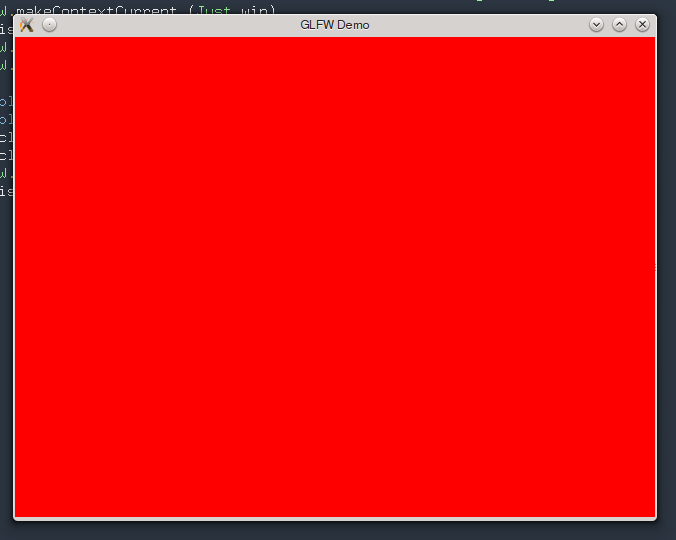

## Haskell OpenGL Tutorial: Resizing main window, key-events.
\
\
We continue with introduction of 2 new functions:

``` haskell
resizeWindow :: GLFW.WindowSizeCallback
resizeWindow win w h =
    do
      GL.viewport   $= (GL.Position 0 0, GL.Size (fromIntegral w) (fromIntegral h))
      GL.matrixMode $= GL.Projection
      GL.loadIdentity
      GL.ortho2D 0 (realToFrac w) (realToFrac h) 0

```
This function adds a callback script for resizing the window, telling OpenGL to reload the context in case the window size was changed.


``` haskell
keyPressed :: GLFW.KeyCallback 
keyPressed win GLFW.Key'Escape _ GLFW.KeyState'Pressed _ = shutdown win
keyPressed _   _               _ _                     _ = return ()

```
This function closes the main window whenever the Esc.Key is pressed.

Now the whole program:

``` haskell
import Graphics.Rendering.OpenGL as GL
import Graphics.UI.GLFW as GLFW
import Control.Monad
import System.Exit ( exitWith, ExitCode(..) )


resizeWindow :: GLFW.WindowSizeCallback
resizeWindow win w h =
    do
      GL.viewport   $= (GL.Position 0 0, GL.Size (fromIntegral w) (fromIntegral h))
      GL.matrixMode $= GL.Projection
      GL.loadIdentity
      GL.ortho2D 0 (realToFrac w) (realToFrac h) 0


keyPressed :: GLFW.KeyCallback 
keyPressed win GLFW.Key'Escape _ GLFW.KeyState'Pressed _ = shutdown win
keyPressed _   _               _ _                     _ = return ()


shutdown :: GLFW.WindowCloseCallback
shutdown win = do
  GLFW.destroyWindow win
  GLFW.terminate
  _ <- exitWith ExitSuccess
  return ()


main :: IO ()
main = do
   GLFW.init
   GLFW.defaultWindowHints
   Just win <- GLFW.createWindow 640 480 "GLFW Demo" Nothing Nothing
   GLFW.makeContextCurrent (Just win)
   GLFW.setWindowSizeCallback win (Just resizeWindow)
   GLFW.setKeyCallback win (Just keyPressed)
   GLFW.setWindowCloseCallback win (Just shutdown)
   onDisplay win
   GLFW.destroyWindow win
   GLFW.terminate


onDisplay :: Window -> IO ()
onDisplay win = do
  GL.clearColor $= Color4 1 0 0 1
  GL.clear [ColorBuffer]
  GLFW.swapBuffers win
  
  forever $ do
     GLFW.pollEvents
     onDisplay win
     
```



The program opens the same window as in the [previous tutorial](https://github.com/madjestic/Haskell-OpenGL-Tutorial/tree/master/tutorial01),
but now it reacts to basic events: if the window is resized or Escape key pressed.


[tutorial files on GitHub](https://github.com/madjestic/Haskell-OpenGL-Tutorial/tree/master/tutorial01)
\
next: [Haskell OpenGL Tutorial: drawing 2 triangles.](../posts/2013-12-30-post-post-modern-opengl-in-haskell-3.html)
\			 
previous: [Post-Post Modern OpenGL in Haskell](../posts/2013-12-30-post-post-modern-opengl-in-haskell-1.html)

