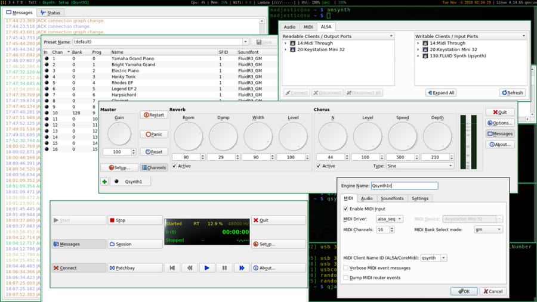

## Some notes primarily to myself and others stuck with JACK, keystation mini 32 midi keyborad under Linux
\
\

[stolen from here:](https://wiki.archlinux.org/index.php/USB_MIDI_keyboards)
\
This guide assumes a kernel that has been setup to support MIDI devices, such as Keystation Mini 32, for example [this kernel config:](https://raw.githubusercontent.com/madjestic/nu/master/usr/src/linux/.config-linux-4.14.78-gentoo)
\
Plug in the keyboard into the USB port and check if your dmesg is showing something similar:

```bash
$ dmesg
...
[30937.290895] usb 3-1: USB disconnect, device number 5
[30942.383408] usb 3-1: new full-speed USB device number 11 using xhci_hcd
[30942.511908] usb 3-1: New USB device found, idVendor=0a4d, idProduct=129d
[30942.511913] usb 3-1: New USB device strings: Mfr=1, Product=2, SerialNumber=0
[30942.511916] usb 3-1: Product: Keystation Mini 32
[30942.511919] usb 3-1: Manufacturer: Keystation Mini 32
```
\
Assuming that you do, let's do the following checks:

```bash
$ aconnect -l
client 0: 'System' [type=kernel]
    0 'Timer           '
    1 'Announce        '
	Connecting To: 15:0, 128:0
client 14: 'Midi Through' [type=kernel]
    0 'Midi Through Port-0'
	Connected From: 20:0
client 15: 'OSS sequencer' [type=kernel]
    0 'Receiver        '
	Connected From: 0:1
client 20: 'Keystation Mini 32' [type=kernel,card=1]
    0 'Keystation Mini 32 MIDI 1'
	Connecting To: 14:0, 129:0
```
```bash
$ aseqdump -p 20
```
where `20` is the client number from the previous command - this can help you see if your midi device is producing any output.
Then start qjackctrl and qsynth:
```bash
$ qjackctl
$ qsynth
```
If qsynth does not show up among ALSA devices, make sure that MIDI driver is set to `alsa_seq`, you should see a picture similar to the one below:
\
\

\
\
If all went fine, connect your Keystation to Qsynth inside ALSA devices window and play some music!

References
[arch-linux wiki](https://wiki.archlinux.org/index.php/USB_MIDI_keyboards)
